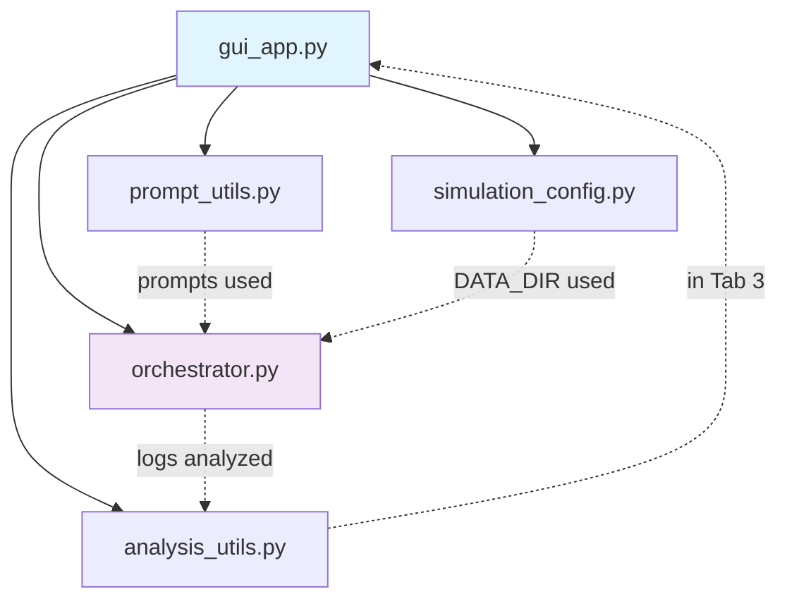

# LLmsTalK! Framework Module Map

## Overview
LLmsTalK! is a Python framework for simulating conversations between two LLM agents with customizable personas, interaction settings, and analysis capabilities. It uses Streamlit for the GUI, OpenRouter/OpenAI API for LLM calls, spaCy for stylometric analysis, and Pandas/Plotly for data visualization and metrics.

The core modules are:
- Configuration: [`simulation_config.py`](simulation_config.py)
- Prompt generation: [`prompt_utils.py`](prompt_utils.py)
- Text analysis: [`analysis_utils.py`](analysis_utils.py)
- Simulation engine: [`orchestrator.py`](orchestrator.py)
- GUI application: [`gui_app.py`](gui_app.py)

Data flow: User configures via GUI → Prompts & configs → Orchestrator runs simulation → Logs saved to JSONL → GUI loads & analyzes logs.

## Module Details

### [`simulation_config.py`](simulation_config.py)
**Purpose**: Defines constants for models, scenarios, and simulation parameters.

**Key Exports**:
- `MODELS_BY_SIZE`: Dict of model categories and OpenRouter slugs.
- `SCENARIOS`: Dict of scenario prompts (unused in current code).
- `NUM_TURNS = 10`: Turns per agent.
- `ITERATIONS = 3`: Repeat count (unused in GUI).
- `DATA_DIR = "data"`: Log output directory.

**Dependencies**: None.

### [`prompt_utils.py`](prompt_utils.py)
**Purpose**: Dynamically constructs system prompts based on interaction setting and persona.

**Key Exports**:
- `construct_system_prompt(scenario_type, persona, custom_instructions="")`: Returns tailored system prompt.

**Dependencies**: None.

**Usage**: Called in [`gui_app.py`](gui_app.py:76,77) to create agent configs.

### [`analysis_utils.py`](analysis_utils.py)
**Purpose**: Applies stylometric analysis (POS ratios) and custom lexicon counting to conversation logs.

**Key Exports**:
- `analyze_text(text)`: Computes token/sentence counts, POS ratios (noun, verb, adj, adv, pron).
- `process_logs(df)`: Adds metrics to DataFrame with 'content' column.
- `count_custom_words(text, category_dict)`: Counts category words.
- `process_custom_lexicon(df, category_dict)`: Adds lexicon columns to DataFrame.

**Dependencies**: spacy (`en_core_web_sm`), pandas.

**Usage**: Called in [`gui_app.py`](gui_app.py:185,187) for Tab 3 analysis.

### [`orchestrator.py`](orchestrator.py)
**Purpose**: Core engine for agent simulation, logging metrics (latency, tokens, refusals).

**Key Classes**:
- `Agent(model_slug, system_prompt, name)`: Manages chat history, generates responses via OpenAI client (OpenRouter), with retry logic.
  - `generate_response(input_text, **kwargs)`: Appends to history, calls API, measures latency/tokens.
- `Orchestrator(agent_a_config, agent_b_config, scenario_name)`: Alternates turns, yields log entries.
  - `run_simulation(num_turns, initial_message)`: Generator yielding log dicts per response.
  - `save_logs(filepath)`: Appends JSONL.

**Log Entry Fields**: experiment_id, turn_id, scenario, speaker_model, responder_model, timestamp, latency_ms, input_tokens, output_tokens, content, finish_reason, is_refusal, system_prompt_snapshot.

**Dependencies**: openai, tenacity (retry), pandas, dotenv, json, logging.

**Usage**: Instantiated and run in [`gui_app.py`](gui_app.py:89-107,112).

### [`gui_app.py`](gui_app.py)
**Purpose**: Streamlit app for setup, live simulation, log viewing, and analysis.

**Key Features**:
- Sidebar: API key, params (turns, temp, max_tokens).
- Tab 1: Agent models/personas, setting/starter → Run simulation → Live chat + metrics.
- Tab 2: Load JSONL → DataFrame + latency/tokens charts.
- Tab 3: Custom lexicon → spaCy analysis + POS/lexicon charts → CSV download.

**Imports from Framework**:
- [`simulation_config`](simulation_config.py:6): NUM_TURNS, ITERATIONS, DATA_DIR.
- [`prompt_utils`](prompt_utils.py:1): construct_system_prompt.
- [`analysis_utils`](analysis_utils.py:7): process_logs, process_custom_lexicon.
- [`orchestrator`](orchestrator.py:90): Orchestrator.

**Dependencies**: streamlit, pandas, plotly.express, os, time.

## Dependency Graph

## Relationships Summary

| Module                  | Role              | Static Imports From | Used By (Static) | Runtime/Data Flow To |
|-------------------------|-------------------|---------------------|------------------|----------------------|
| [`simulation_config.py`](simulation_config.py) | Config       | -                   | gui_app.py      | orchestrator.py (DATA_DIR) |
| [`prompt_utils.py`](prompt_utils.py)         | Prompt Gen   | -                   | gui_app.py      | orchestrator.py (via config) |
| [`analysis_utils.py`](analysis_utils.py)     | Analysis     | spacy, pandas       | gui_app.py      | -                    |
| [`orchestrator.py`](orchestrator.py)         | Simulation   | openai, etc.        | gui_app.py      | analysis_utils.py (logs) |
| [`gui_app.py`](gui_app.py)                   | UI/Driver     | all above           | -               | -                    |

## Other Files
- `requirements.txt`: Dependencies (streamlit, openai, spacy, etc.).
- `.env.example`: OPENROUTER_API_KEY template.
- `README.md`, `LICENSE`, `.gitignore`: Project metadata.
- `package-lock.json`: Possibly unrelated (Node.js artifact?).

This map captures static imports and key data flows as of current codebase.