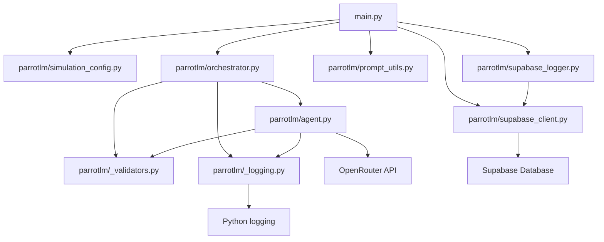

# ParrotLM Module Map

## Overview
ParrotLM is a Python framework for simulating multi-turn conversations between two LLM agents and logging the interaction telemetry to a Supabase database.

Current runtime flow:
1. `main.py` serves as the entrypoint. It initializes infrastructure, configures agents, and kicks off the execution.
2. `simulation_config.py` loads environment variables to set up the scenario.
3. `orchestrator.py` manages the back-and-forth interaction between two `Agent` instances.
4. Each `Agent` makes resilient calls to the OpenRouter API.
5. `supabase_logger.py` batches the resulting interaction logs and safely uploads them to the `session_logs` table.

The codebase adheres strictly to team-friendly principles: simple over clever, readable over efficient, single-purpose functions, and 100% test coverage.

## Repository Structure

### Entrypoint
- `main.py`: Top-level execution pipeline (initialize, configure, execute, process).

### Core Package (`parrotlm/`)
- `agent.py`: Single LLM agent managing model config, history window, Tenacity retries, and API calls.
- `orchestrator.py`: Orchestrates multi-turn conversations between two agents and generates structured logs.
- `prompt_utils.py`: Constructs strict, dialogue-only system prompts from persona strings.
- `simulation_config.py`: Environment-based configuration loader with safe defaults.
- `supabase_client.py`: Supabase client singleton managing credential resolution and caching.
- `supabase_logger.py`: Sanitizes and batch-inserts simulation logs into the Supabase database.

### Utilities (`parrotlm/`)
- `_logging.py`: Structured JSON logging utilities (formatters, event extraction, exception filtering).
- `_validators.py`: Input validation helpers (type casting, required field verification).

### Tests (`tests/`)
- `test_agent.py`
- `test_logging.py`
- `test_main.py`
- `test_orchestrator.py`
- `test_prompt_utils.py`
- `test_simulation_config.py`
- `test_supabase_client.py`
- `test_supabase_logger.py`
- `test_validators.py`
- `README.md`: Test suite documentation.

## Module Details

### `main.py`
Purpose:
- Ties together the configuration, execution, and data upload phases of the simulation.
- Safely catches and logs unhandled exceptions with their exact phase context.

### `parrotlm/simulation_config.py`
Purpose:
- Loads environment variables (`MODEL_A`, `NUM_TURNS`, `OPENROUTER_API_KEY`, etc.).
- Safely casts types and provides defaults if variables are missing.
- Optionally loads a `.env` file for local development convenience.

### `parrotlm/agent.py`
Purpose:
- Encapsulates a single LLM agent interacting with OpenRouter.
- Keeps conversation history role-aligned and bounded by a context window.
- Manages transient network errors using an exponential backoff retry decorator.

### `parrotlm/orchestrator.py`
Purpose:
- Coordinates the conversational ping-pong between `Agent A` and `Agent B`.
- Normalizes per-turn metadata into a structured log dictionary.
- Checks for stop conditions (like model refusals) to safely halt the simulation.

### `parrotlm/prompt_utils.py`
Purpose:
- Injects personas into a highly constrained system prompt.
- Explicitly forbids narration, actions, brackets, and asterisks.

### `parrotlm/supabase_client.py`
Purpose:
- Manages the lifecycle of the Supabase client object.
- Caches the client at the module level to reuse HTTP connection pools across operations.

### `parrotlm/supabase_logger.py`
Purpose:
- Verifies Supabase client availability.
- Sanitizes generated logs to perfectly match the strict PostgreSQL schema.
- Executes the batch insert into the `session_logs` table.

### `parrotlm/_logging.py`
Purpose:
- Formats standard library logs into either human-readable console output or machine-readable JSONlines.
- Provides `log_structured` for easy, context-rich telemetry.

### `parrotlm/_validators.py`
Purpose:
- Safely casts and verifies standard inputs and API response payloads.
- Stops bad data early before it reaches orchestration or database logic.

## Dependency Graph

```mermaid
graph TD
    main[main.py] --> cfg[parrotlm/simulation_config.py]
    main --> orch[parrotlm/orchestrator.py]
    main --> prompt[parrotlm/prompt_utils.py]
    main --> supalog[parrotlm/supabase_logger.py]
    main --> supacli[parrotlm/supabase_client.py]

    orch --> agent[parrotlm/agent.py]
    orch --> val[parrotlm/_validators.py]
    orch --> log[parrotlm/_logging.py]

    supalog --> supacli

    agent --> val
    agent --> log
    agent --> openrouter[OpenRouter API]

    log --> stdlib[Python logging]
    supacli --> supabase[Supabase Database]
```

## Supporting Files
- `README.md`: Project-level usage and setup.
- `requirements.txt`: Python runtime dependencies.
- `.env.example`: Environment variable template.
- `LICENSE`: Apache 2.0 license.
