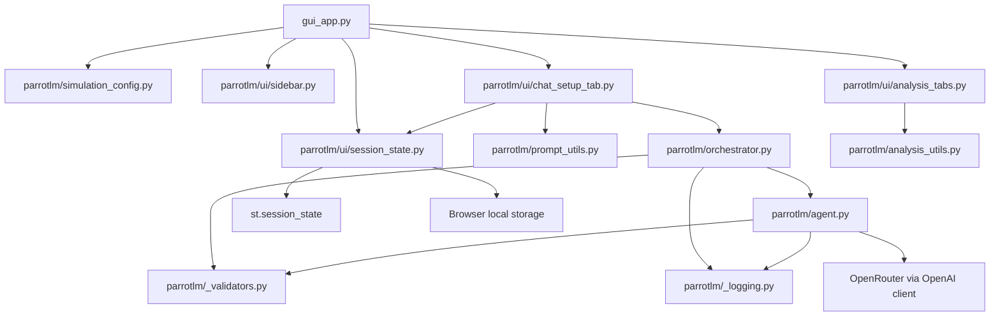

# ParrotLM Module Map

## Overview
ParrotLM is a Streamlit-based Python app for simulating conversations between two LLM agents and analyzing the generated logs.

Current runtime flow:
1. `gui_app.py` initializes Streamlit, local storage, and tabs.
2. UI modules collect configuration and run simulations through `Orchestrator`.
3. Conversation logs are stored in `st.session_state` and browser local storage.
4. Analysis tabs process in-memory logs with stylometric and custom lexicon metrics.

The app uses the OpenAI Python client configured for OpenRouter.

## Repository Structure

### Entrypoint
- `gui_app.py`: top-level Streamlit app composition and tab wiring.

### Core package
- `parrotlm/simulation_config.py`: default simulation constants and config validation.
- `parrotlm/prompt_utils.py`: system-prompt construction from persona text.
- `parrotlm/_validators.py`: input validation helpers and API-key resolver.
- `parrotlm/_logging.py`: structured logging utilities.
- `parrotlm/agent.py`: single LLM agent — model config, history window, retries, and API calls.
- `parrotlm/orchestrator.py`: orchestrates multi-turn conversations between two agents.
- `parrotlm/analysis_utils.py`: NLTK-based text metrics and custom lexicon counting.

### UI package
- `parrotlm/ui/sidebar.py`: sidebar controls (API key and technical settings).
- `parrotlm/ui/chat_setup_tab.py`: chatbot setup UI and simulation execution flow.
- `parrotlm/ui/analysis_tabs.py`: basic and stylometric analysis tabs.
- `parrotlm/ui/session_state.py`: session-state initialization and local persistence helpers.
- `parrotlm/ui/__init__.py`: UI package marker.

### Tests
- `tests/test_simulation_config.py`
- `tests/test_prompt_utils.py`
- `tests/test_analysis_utils.py`
- `tests/test_orchestrator.py`
- `tests/test_session_state.py`
- `tests/README.md`: test intent and execution notes.

## Module Details

### `parrotlm/simulation_config.py`
Purpose:
- Defines default runtime values:
  - `NUM_TURNS`
  - `DATA_DIR`
- Exposes `validate_simulation_config(...)` for input validation.

Used by:
- `gui_app.py` (default turns)
- tests in `tests/test_simulation_config.py`

### `parrotlm/prompt_utils.py`
Purpose:
- Builds constrained dialogue-only system prompts from persona strings.

Key export:
- `construct_system_prompt(persona: str) -> str`

Used by:
- `parrotlm/ui/chat_setup_tab.py`
- tests in `tests/test_prompt_utils.py`

### `parrotlm/_validators.py`
Purpose:
- Validates and normalizes caller inputs (strings, integers, dicts, response payloads).
- Resolves the OpenRouter API key from env or `.env`.

Used by:
- `parrotlm/agent.py`
- `parrotlm/orchestrator.py`

### `parrotlm/_logging.py`
Purpose:
- `log_structured`: emits machine-readable log events with JSON context.
- `is_retryable_exception`: filter for tenacity retry decorator.

Used by:
- `parrotlm/agent.py`
- `parrotlm/orchestrator.py`

### `parrotlm/agent.py`
Purpose:
- Encapsulates a single LLM agent: model slug, system prompt, conversation history, and API calls.
- Applies a bounded sliding-window history and exponential-backoff retries.

Key export:
- `Agent`

Used by:
- `parrotlm/orchestrator.py`
- tests in `tests/test_orchestrator.py`

### `parrotlm/orchestrator.py`
Purpose:
- Coordinates a multi-turn conversation between two `Agent` instances.
- Normalizes per-turn metadata into structured log entries.
- Re-exports `Agent` for backward-compatible imports.

Key outputs per log entry:
- `experiment_id`, `turn_id`, `scenario`, `speaker_model`, `responder_model`
- `timestamp`, `latency_ms`, `input_tokens`, `output_tokens`
- `content`, `finish_reason`, `is_refusal`, `system_prompt_snapshot`

Used by:
- `parrotlm/ui/chat_setup_tab.py`
- tests in `tests/test_orchestrator.py`

### `parrotlm/analysis_utils.py`
Purpose:
- Computes stylometric metrics from text content.
- Adds custom category-based word counts.

Key exports:
- `ensure_nltk_resources(...)`
- `analyze_text(text)`
- `process_logs(df)`
- `count_custom_words(text, category_dict)`
- `process_custom_lexicon(df, category_dict)`

Used by:
- `parrotlm/ui/analysis_tabs.py`
- tests in `tests/test_analysis_utils.py`

### `parrotlm/ui/sidebar.py`
Purpose:
- Renders technical controls and API key input.
- Returns typed settings (`TechnicalSettings`) and clear-data trigger.

Used by:
- `gui_app.py`

### `parrotlm/ui/chat_setup_tab.py`
Purpose:
- Renders chatbot setup form.
- Builds agent configs and runs `Orchestrator.run_simulation(...)`.
- Streams live messages and persists resulting logs.

Used by:
- `gui_app.py`

### `parrotlm/ui/analysis_tabs.py`
Purpose:
- Renders:
  - Basic analysis tab (latency/token summaries).
  - Stylometric tab (POS ratios, custom lexicon, CSV export).

Used by:
- `gui_app.py`

### `parrotlm/ui/session_state.py`
Purpose:
- Initializes required session keys.
- Loads and clears browser-persisted logs.
- Appends/persists newly generated logs.

Used by:
- `gui_app.py`
- `parrotlm/ui/chat_setup_tab.py`
- tests in `tests/test_session_state.py`

## Dependency Graph

```mermaid
graph TD
    app[gui_app.py] --> cfg[parrotlm/simulation_config.py]
    app --> side[parrotlm/ui/sidebar.py]
    app --> chat[parrotlm/ui/chat_setup_tab.py]
    app --> tabs[parrotlm/ui/analysis_tabs.py]
    app --> state[parrotlm/ui/session_state.py]

    chat --> prompt[parrotlm/prompt_utils.py]
    chat --> orch[parrotlm/orchestrator.py]
    tabs --> analysis[parrotlm/analysis_utils.py]
    chat --> state

    orch --> agent[parrotlm/agent.py]
    orch --> val[parrotlm/_validators.py]
    orch --> log[parrotlm/_logging.py]
    agent --> val
    agent --> log
    agent --> openrouter[OpenRouter via OpenAI client]

    state --> session[st.session_state]
    state --> local[Browser local storage]
```

## Supporting Files
- `README.md`: project-level usage and setup.
- `requirements.txt`: runtime dependencies.
- `.env.example`: API key template (`OPENROUTER_API_KEY`).
- `runtime.txt`: runtime pinning for deployment environments.
- `LICENSE`: Apache 2.0 license.

Updated to reflect the current repository state.
