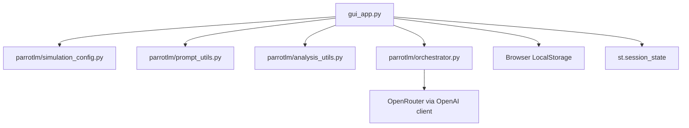

# ParrotLM Framework Module Map

## Overview
ParrotLM simula conversazioni tra due agenti LLM con interfaccia Streamlit, generazione prompt personalizzati e analisi testuale. Le chiamate LLM passano tramite client OpenAI puntato a OpenRouter. L'analisi stilometrica usa NLTK (non spaCy).

Moduli principali:
- Configurazione: [`parrotlm/simulation_config.py`](parrotlm/simulation_config.py)
- Prompt generation: [`parrotlm/prompt_utils.py`](parrotlm/prompt_utils.py)
- Text analysis: [`parrotlm/analysis_utils.py`](parrotlm/analysis_utils.py)
- Simulation engine: [`parrotlm/orchestrator.py`](parrotlm/orchestrator.py)
- GUI: [`gui_app.py`](gui_app.py)

Data flow reale:
- Utente configura dalla GUI.
- La GUI crea i system prompt e inizializza l'orchestrator.
- L'orchestrator produce log per ogni messaggio.
- La GUI salva i log in `st.session_state` + browser local storage.
- Tab analisi elabora i log in memoria.
- `save_logs()` JSONL esiste ma non e usato dalla GUI corrente.

## Module Details

### [`parrotlm/simulation_config.py`](parrotlm/simulation_config.py)
**Purpose**: Costanti base della simulazione.

**Key exports**:
- `NUM_TURNS = 10`
- `DATA_DIR = "data"`

**Notes**:
- Non contiene `MODELS_BY_SIZE`, `SCENARIOS`, `ITERATIONS`.

### [`parrotlm/prompt_utils.py`](parrotlm/prompt_utils.py)
**Purpose**: Costruzione del system prompt da persona testuale.

**Key exports**:
- `construct_system_prompt(persona)`

**Usage**:
- Chiamata in [`gui_app.py`](gui_app.py:89) e [`gui_app.py`](gui_app.py:90).

### [`parrotlm/analysis_utils.py`](parrotlm/analysis_utils.py)
**Purpose**: Analisi linguistica e conteggio lessicale custom sui log.

**Key exports**:
- `analyze_text(text)`: token/sentence count + POS ratios.
- `process_logs(df)`: applica `analyze_text` alla colonna `content`.
- `count_custom_words(text, category_dict)`: conteggio per categorie.
- `process_custom_lexicon(df, category_dict)`: aggiunge colonne lessicali.

**Dependencies**:
- `nltk`, `pandas`, `collections.Counter`.

**Usage**:
- Chiamata in [`gui_app.py`](gui_app.py:236) e [`gui_app.py`](gui_app.py:238).

### [`parrotlm/orchestrator.py`](parrotlm/orchestrator.py)
**Purpose**: Motore di simulazione agent-to-agent, con metriche per turno.

**Key classes**:
- `Agent(model_slug, system_prompt, name, max_history_turns=20)`
  - `generate_response(input_text, **kwargs)`: invoca API chat completions, misura latenza/token, aggiorna history.
- `Orchestrator(agent_a_config, agent_b_config, scenario_name, experiment_id=None)`
  - `run_simulation(num_turns, initial_message="Hello.")`: generator dei log entry.
  - `save_logs(filepath)`: append JSONL su file.

**Log entry fields**:
- `experiment_id`, `turn_id`, `scenario`, `speaker_model`, `responder_model`, `timestamp`, `latency_ms`, `input_tokens`, `output_tokens`, `content`, `finish_reason`, `is_refusal`, `system_prompt_snapshot`.

**Dependencies**:
- `openai`, `tenacity`, `python-dotenv`, `json`, `logging`, `pandas`.

### [`gui_app.py`](gui_app.py)
**Purpose**: App Streamlit per setup, run live, persistenza locale e analisi.

**Key features**:
- Sidebar: API key, turns, temperature, max tokens, context window.
- Tab 1: setup due chatbot e simulazione live.
- Tab 2: analisi base (latenza e token medi).
- Tab 3: analisi NLTK + lessico custom + export CSV.
- Persistenza log in browser via `streamlit_local_storage`.

**Framework imports**:
- [`parrotlm/simulation_config.py`](parrotlm/simulation_config.py): `NUM_TURNS` (`gui_app.py:7`)
- [`parrotlm/prompt_utils.py`](parrotlm/prompt_utils.py): `construct_system_prompt` (`gui_app.py:9`)
- [`parrotlm/analysis_utils.py`](parrotlm/analysis_utils.py): `process_logs`, `process_custom_lexicon` (`gui_app.py:8`)
- [`parrotlm/orchestrator.py`](parrotlm/orchestrator.py): import locale di `Orchestrator` (`gui_app.py:96`)

## Dependency Graph

```mermaid
graph TD
    gui[gui_app.py] --> config[parrotlm/simulation_config.py]
    gui --> prompts[parrotlm/prompt_utils.py]
    gui --> analysis[parrotlm/analysis_utils.py]
    gui --> orch[parrotlm/orchestrator.py]

    orch --> openrouter[OpenRouter via OpenAI client]
    gui --> localstore[Browser LocalStorage]
    gui --> session[st.session_state]
```

## Relationships Summary
| Module | Role | Static Imports From | Used By (Static) | Runtime/Data Flow To |
|---|---|---|---|---|
| [`parrotlm/simulation_config.py`](parrotlm/simulation_config.py) | Config | - | [`gui_app.py`](gui_app.py) | GUI defaults |
| [`parrotlm/prompt_utils.py`](parrotlm/prompt_utils.py) | Prompt Gen | - | [`gui_app.py`](gui_app.py) | `Orchestrator` via prompt strings |
| [`parrotlm/analysis_utils.py`](parrotlm/analysis_utils.py) | Analysis | `nltk`, `pandas` | [`gui_app.py`](gui_app.py) | Analisi tab 3 |
| [`parrotlm/orchestrator.py`](parrotlm/orchestrator.py) | Simulation | `openai`, `tenacity`, etc. | [`gui_app.py`](gui_app.py) | Log entries verso GUI |
| [`gui_app.py`](gui_app.py) | UI/Driver | moduli core | - | LocalStorage, visualizzazioni |

## Other Files
- [`requirements.txt`](requirements.txt): dipendenze Python.
- [`.env.example`](.env.example): template `OPENROUTER_API_KEY`.
- [`README.md`](README.md), [`LICENSE`](LICENSE), [`.gitignore`](.gitignore): metadata progetto.
- [`.devcontainer/devcontainer.json`](.devcontainer/devcontainer.json): ambiente containerizzato per sviluppo.

Mappa aggiornata allo stato attuale del repository.
